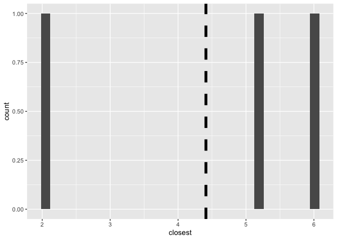
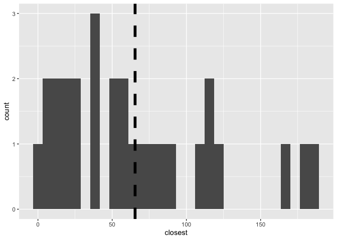
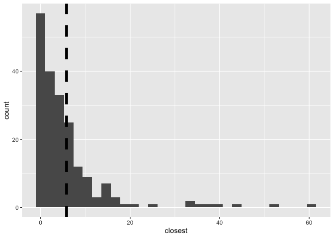
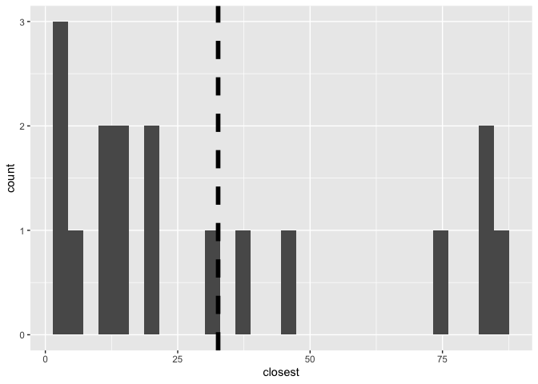

Lab 04 - La Quinta is Spanish for next to Denny’s, Pt. 2
================
Elayna Seago
2/16/22

### Load packages and data

``` r
library(tidyverse) 
library(dsbox) 
```

``` r
states <- read_csv("data/states.csv")
```

### Exercise 1

There are 3 dennys in Alaska

``` r
dn_ak <- dennys %>%
  filter(state == "AK")
nrow(dn_ak)
```

    ## [1] 3

### Exercise 2

There are 2 laquintas

``` r
lq_ak <- laquinta %>%
  filter(state == "AK")
nrow(lq_ak)
```

    ## [1] 2

### Exercise 3

``` r
dn_lq_ak <- full_join(dn_ak, lq_ak, by = "state")
dn_lq_ak
```

    ## # A tibble: 6 × 11
    ##   address.x   city.x state zip.x longitude.x latitude.x address.y  city.y  zip.y
    ##   <chr>       <chr>  <chr> <chr>       <dbl>      <dbl> <chr>      <chr>   <chr>
    ## 1 2900 Denali Ancho… AK    99503       -150.       61.2 3501 Minn… "\nAnc… 99503
    ## 2 2900 Denali Ancho… AK    99503       -150.       61.2 4920 Dale… "\nFai… 99709
    ## 3 3850 Debar… Ancho… AK    99508       -150.       61.2 3501 Minn… "\nAnc… 99503
    ## 4 3850 Debar… Ancho… AK    99508       -150.       61.2 4920 Dale… "\nFai… 99709
    ## 5 1929 Airpo… Fairb… AK    99701       -148.       64.8 3501 Minn… "\nAnc… 99503
    ## 6 1929 Airpo… Fairb… AK    99701       -148.       64.8 4920 Dale… "\nFai… 99709
    ## # … with 2 more variables: longitude.y <dbl>, latitude.y <dbl>

### Exercise 4

There are 6 observations and the variables are address, city, zip, long
and lat for each dennys and laquinta location, and state.

``` r
nrow(dn_lq_ak)
```

    ## [1] 6

``` r
ls(dn_lq_ak)
```

    ##  [1] "address.x"   "address.y"   "city.x"      "city.y"      "latitude.x" 
    ##  [6] "latitude.y"  "longitude.x" "longitude.y" "state"       "zip.x"      
    ## [11] "zip.y"

### Exercise 5

``` r
haversine <- function(long1, lat1, long2, lat2, round = 3) {
  # convert to radians
  long1 = long1 * pi / 180
  lat1  = lat1  * pi / 180
  long2 = long2 * pi / 180
  lat2  = lat2  * pi / 180
  
  R = 6371 # Earth mean radius in km
  
  a = sin((lat2 - lat1)/2)^2 + cos(lat1) * cos(lat2) * sin((long2 - long1)/2)^2
  d = R * 2 * asin(sqrt(a))
  
  return( round(d,round) ) # distance in km
}
```

### Exercise 6

``` r
dn_lq_ak <- mutate(dn_lq_ak, distance = haversine(longitude.x, latitude.x, longitude.y, latitude.y, round = 3))
```

### Exercise 7

``` r
dn_lq_ak_mindist <- dn_lq_ak %>%
  group_by(address.x) %>%
  summarize(closest = min(distance))

dn_lq_ak_mindist
```

    ## # A tibble: 3 × 2
    ##   address.x        closest
    ##   <chr>              <dbl>
    ## 1 1929 Airport Way    5.20
    ## 2 2900 Denali         2.04
    ## 3 3850 Debarr Road    6.00

### Exercise 8

Because there are only 3 Dennys and 2 laquintas in Alaska, the
distribution is not particularly informative. Dennys and lquintas are
close together, on average they are 4.41 miles apart.

``` r
mean(dn_lq_ak_mindist$closest)
```

    ## [1] 4.41

``` r
ggplot(dn_lq_ak_mindist, aes(x = closest))+
  geom_histogram() +
  geom_vline(xintercept = mean(dn_lq_ak_mindist$closest), lwd = 2 , linetype = 2 , color = "black")
```

    ## `stat_bin()` using `bins = 30`. Pick better value with `binwidth`.

<!-- -->

### Exercise 9

NC There is a slight positive skew, but noting the change in X axis, the
distance between laquintas and Dennys is much larger in NC than in
AK.The mean distance to the closest is 65 miles.

``` r
dn_nc <- dennys %>%
  filter(state == "NC")
nrow(dn_nc)
```

    ## [1] 28

``` r
lq_nc <- laquinta %>%
  filter(state == "NC")
nrow(lq_nc)
```

    ## [1] 12

``` r
dn_lq_nc <- full_join(dn_nc, lq_nc, by = "state")
dn_lq_nc
```

    ## # A tibble: 336 × 11
    ##    address.x  city.x  state zip.x longitude.x latitude.x address.y  city.y zip.y
    ##    <chr>      <chr>   <chr> <chr>       <dbl>      <dbl> <chr>      <chr>  <chr>
    ##  1 1 Regent … Ashevi… NC    28806       -82.6       35.6 165 Hwy 1… "\nBo… 28607
    ##  2 1 Regent … Ashevi… NC    28806       -82.6       35.6 3127 Sloa… "\nCh… 28208
    ##  3 1 Regent … Ashevi… NC    28806       -82.6       35.6 4900 Sout… "\nCh… 28217
    ##  4 1 Regent … Ashevi… NC    28806       -82.6       35.6 4414 Durh… "\nDu… 27707
    ##  5 1 Regent … Ashevi… NC    28806       -82.6       35.6 1910 West… "\nDu… 27713
    ##  6 1 Regent … Ashevi… NC    28806       -82.6       35.6 1201 Lana… "\nGr… 27407
    ##  7 1 Regent … Ashevi… NC    28806       -82.6       35.6 1607 Fair… "\nCo… 28613
    ##  8 1 Regent … Ashevi… NC    28806       -82.6       35.6 191 Cresc… "\nCa… 27518
    ##  9 1 Regent … Ashevi… NC    28806       -82.6       35.6 2211 Summ… "\nRa… 27612
    ## 10 1 Regent … Ashevi… NC    28806       -82.6       35.6 1001 Aeri… "\nMo… 27560
    ## # … with 326 more rows, and 2 more variables: longitude.y <dbl>,
    ## #   latitude.y <dbl>

``` r
dn_lq_nc <- mutate(dn_lq_nc, distance = haversine(longitude.x, latitude.x, longitude.y, latitude.y, round = 3))

dn_lq_nc_mindist <- dn_lq_nc %>%
  group_by(address.x) %>%
  summarize(closest = min(distance))

dn_lq_nc_mindist
```

    ## # A tibble: 28 × 2
    ##    address.x                 closest
    ##    <chr>                       <dbl>
    ##  1 1 Regent Park Boulevard     108. 
    ##  2 101 Wintergreen Dr          120. 
    ##  3 103 Sedgehill Dr             26.7
    ##  4 1043 Jimmie Kerr Road        36.1
    ##  5 1201 S College Road         188. 
    ##  6 1209 Burkemount Avenue       39.1
    ##  7 1493 Us Hwy 74-A Bypass      70.1
    ##  8 1524 Dabney Dr               59.5
    ##  9 1550 Four Seasons           115. 
    ## 10 1800 Princeton-Kenly Road    55.9
    ## # … with 18 more rows

``` r
mean(dn_lq_nc_mindist$closest)
```

    ## [1] 65.44432

``` r
ggplot(dn_lq_nc_mindist, aes(x = closest))+
  geom_histogram() +
  geom_vline(xintercept = mean(dn_lq_nc_mindist$closest), lwd = 2 , linetype = 2 , color = "black")
```

    ## `stat_bin()` using `bins = 30`. Pick better value with `binwidth`.

<!-- -->

### Exercise 10

TX The mean distance to the closest Dennys is 5 miles. The distribution
is very positively skewed. This state is the one where the joke seems to
make the most sense (the mean is smaller aka closer for AK, but the
sample size is very small).

``` r
dn_tx <- dennys %>%
  filter(state == "TX")
nrow(dn_tx)
```

    ## [1] 200

``` r
lq_tx <- laquinta %>%
  filter(state == "TX")
nrow(lq_tx)
```

    ## [1] 237

``` r
dn_lq_tx <- full_join(dn_tx, lq_tx, by = "state")
dn_lq_tx
```

    ## # A tibble: 47,400 × 11
    ##    address.x  city.x  state zip.x longitude.x latitude.x address.y  city.y zip.y
    ##    <chr>      <chr>   <chr> <chr>       <dbl>      <dbl> <chr>      <chr>  <chr>
    ##  1 120 East … Abilene TX    79601       -99.6       32.4 3018 CatC… "\nAb… 79606
    ##  2 120 East … Abilene TX    79601       -99.6       32.4 3501 West… "\nAb… 79601
    ##  3 120 East … Abilene TX    79601       -99.6       32.4 14925 Lan… "\nAd… 75254
    ##  4 120 East … Abilene TX    79601       -99.6       32.4 909 East … "\nAl… 78516
    ##  5 120 East … Abilene TX    79601       -99.6       32.4 2400 East… "\nAl… 78332
    ##  6 120 East … Abilene TX    79601       -99.6       32.4 1220 Nort… "\nAl… 75013
    ##  7 120 East … Abilene TX    79601       -99.6       32.4 1165 Hwy … "\nAl… 76009
    ##  8 120 East … Abilene TX    79601       -99.6       32.4 880 South… "\nAl… 77511
    ##  9 120 East … Abilene TX    79601       -99.6       32.4 1708 Inte… "\nAm… 79103
    ## 10 120 East … Abilene TX    79601       -99.6       32.4 9305 East… "\nAm… 79118
    ## # … with 47,390 more rows, and 2 more variables: longitude.y <dbl>,
    ## #   latitude.y <dbl>

``` r
dn_lq_tx <- mutate(dn_lq_tx, distance = haversine(longitude.x, latitude.x, longitude.y, latitude.y, round = 3))

dn_lq_tx_mindist <- dn_lq_tx %>%
  group_by(address.x) %>%
  summarize(closest = min(distance))

dn_lq_tx_mindist
```

    ## # A tibble: 200 × 2
    ##    address.x             closest
    ##    <chr>                   <dbl>
    ##  1 100 Cottonwood         33.6  
    ##  2 100 E Pinehurst         1.39 
    ##  3 100 Us Highway 79 S    33.9  
    ##  4 101 N Fm 707           10.3  
    ##  5 1011 Beltway Parkway   14.0  
    ##  6 1015 Spur 350 West      1.74 
    ##  7 1015 West Main St       1.10 
    ##  8 10367 Highway 59       37.6  
    ##  9 10433 N Central Expwy   0.618
    ## 10 105 W 42nd St           6.88 
    ## # … with 190 more rows

``` r
mean(dn_lq_tx_mindist$closest)
```

    ## [1] 5.7918

``` r
ggplot(dn_lq_tx_mindist, aes(x = closest))+
  geom_histogram() +
  geom_vline(xintercept = mean(dn_lq_tx_mindist$closest), lwd = 2 , linetype = 2 , color = "black")
```

    ## `stat_bin()` using `bins = 30`. Pick better value with `binwidth`.

<!-- -->

### Exercise 11

SC On average, dennys and laquintas are 32 miles apart in SC. This
distribution is wide and flat and not bell curved at all.

``` r
dn_sc <- dennys %>%
  filter(state == "SC")
nrow(dn_sc)
```

    ## [1] 17

``` r
lq_sc <- laquinta %>%
  filter(state == "SC")
nrow(lq_sc)
```

    ## [1] 8

``` r
dn_lq_sc <- full_join(dn_sc, lq_sc, by = "state")
dn_lq_sc
```

    ## # A tibble: 136 × 11
    ##    address.x  city.x  state zip.x longitude.x latitude.x address.y city.y  zip.y
    ##    <chr>      <chr>   <chr> <chr>       <dbl>      <dbl> <chr>     <chr>   <chr>
    ##  1 3401 Clem… Anders… SC    29621       -82.7       34.5 11 Ashle… "\nCha… 29407
    ##  2 3401 Clem… Anders… SC    29621       -82.7       34.5 1538 Hor… "\nCol… 29223
    ##  3 3401 Clem… Anders… SC    29621       -82.7       34.5 7333 Gar… "\nCol… 29209
    ##  4 3401 Clem… Anders… SC    29621       -82.7       34.5 2123 Wes… "\nFlo… 29501
    ##  5 3401 Clem… Anders… SC    29621       -82.7       34.5 65 West … "\nGre… 29615
    ##  6 3401 Clem… Anders… SC    29621       -82.7       34.5 4709 Nor… "\nMyr… 29577
    ##  7 3401 Clem… Anders… SC    29621       -82.7       34.5 1561 21s… "\nMyr… 29577
    ##  8 3401 Clem… Anders… SC    29621       -82.7       34.5 1601B Hw… "\nNor… 29582
    ##  9 1011 N Mo… Blacks… SC    29702       -81.5       35.1 11 Ashle… "\nCha… 29407
    ## 10 1011 N Mo… Blacks… SC    29702       -81.5       35.1 1538 Hor… "\nCol… 29223
    ## # … with 126 more rows, and 2 more variables: longitude.y <dbl>,
    ## #   latitude.y <dbl>

``` r
dn_lq_sc <- mutate(dn_lq_sc, distance = haversine(longitude.x, latitude.x, longitude.y, latitude.y, round = 3))

dn_lq_sc_mindist <- dn_lq_sc %>%
  group_by(address.x) %>%
  summarize(closest = min(distance))

dn_lq_sc_mindist
```

    ## # A tibble: 17 × 2
    ##    address.x                closest
    ##    <chr>                      <dbl>
    ##  1 1011 N Mountain St         82.0 
    ##  2 113 Motel Drive            75.7 
    ##  3 115 Sloan Garden Road      38.8 
    ##  4 1200 Us Highway 17 North   13.0 
    ##  5 124 Loyola Drive           12.5 
    ##  6 2280 Ashley Phosphate Rd   19.2 
    ##  7 2306 Reidville Road        32.2 
    ##  8 2435 Mt Holly Road         86.8 
    ##  9 2514 Sunset Blvd           15.1 
    ## 10 2521 Wade Hampton           3.98
    ## 11 3401 Clemson Boulevard     46.1 
    ## 12 342 Harbison Blvd          19.1 
    ## 13 3536 Point South Dr        84.0 
    ## 14 5270 International Blvd    12.0 
    ## 15 5901 Fairfield Dr           7.11
    ## 16 730 Highway 17 South        3.44
    ## 17 800 S Kings Hwy             3.87

``` r
mean(dn_lq_sc_mindist$closest)
```

    ## [1] 32.63406

``` r
ggplot(dn_lq_sc_mindist, aes(x = closest))+
  geom_histogram() +
  geom_vline(xintercept = mean(dn_lq_sc_mindist$closest), lwd = 2 , linetype = 2 , color = "black")
```

    ## `stat_bin()` using `bins = 30`. Pick better value with `binwidth`.

<!-- -->
